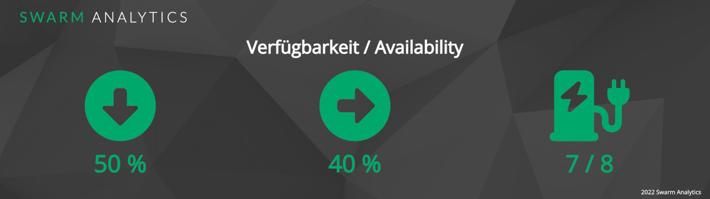
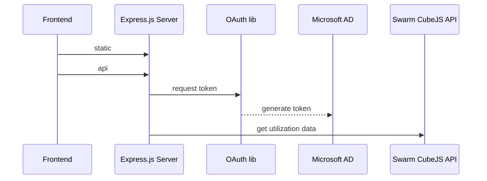

# Swarm Analytics Example Integration - Parking Dashboard

This is a simple example of how to integrate the Swarm Analytics data API and use it for a simple parking dashboard.



---

## Usage
The application is packed into a docker container, which can be run from the command line.

```
docker run -e CLIENT_ID=<your-client-id> -e CLIENT_SECRET=<your-client-secret> -e TENANT_ID=<your-tenant-id> -p 80:8080 -d swarm.azurecr.io/hkp-parking-dashboard:latest
```

The dashboard is now available at [http://localhost:80](http://localhost:80) and will refresh automatically every 10 seconds.

For the API secrets, please have a look at [our documentation](https://docs.swarm-analytics.com/swarm-academy/swarm-control-center-1/data-integration/swarm-api) or [contact the support](https://swarm-hal9000.atlassian.net/servicedesk/customer/portal/1).

To adjust the data queries, you can alter the `config.yml` file or mount a custom file into the container to `/app/config.yml`.

## Architecture

The application is built using the [Swarm Analytics API](https://docs.swarm-analytics.com/swarm-academy/swarm-control-center-1/data-integration/swarm-api) which is based on the [CubeJS REST API](https://cube.dev/docs/rest-api).



### Components
- **api**: Wrapper for the CubeJS REST API including Microsoft OAuth Flow for authentication
- **static**: Static files for the frontend (HTML, CSS, JS)
- **app.js**: Main application with an Express.js server
- **config.yml**: Configuration including the CubeJS queries

## API

The application wraps the CubeJS REST API to only expose the relevant data to the frontend. Additionally, the application uses the Microsoft OAuth Flow to authenticate.

More details on the CubeJS REST API can be found [here](https://cube.dev/docs/rest-api).
